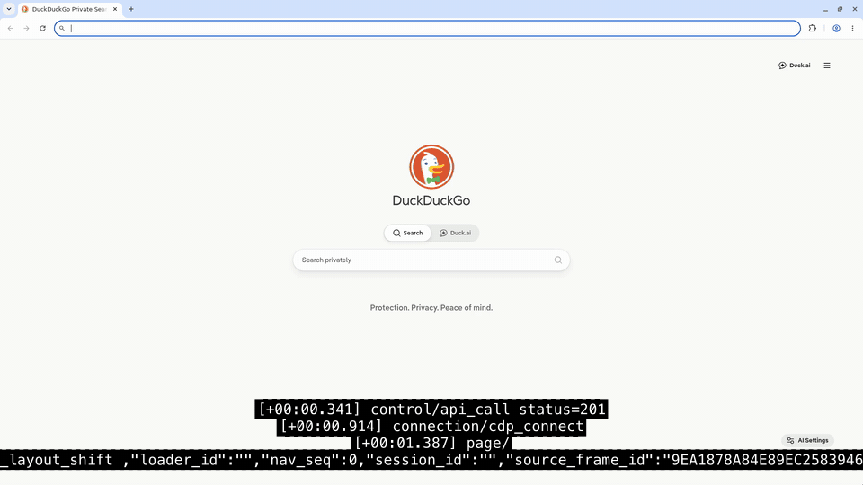

# Session Replay Telemetry SRT

TypeScript CLI that turns Kernel browser telemetry into `.srt` subtitle files for every replay under a browser session. For each replay, it uses the replay's UTC `started_at` / `finished_at` timestamps, fetches telemetry from the same window, and writes subtitle cues relative to that replay video's start time.



*A downloaded replay with the generated telemetry subtitles burned in — `network`, `page`, and `console` events captioned in sync with the video.*

## Setup

```bash
npm install
export KERNEL_API_KEY=your_api_key
```

## Usage

```bash
# Generate one SRT per replay under a browser session
npx tsx index.ts <browser-session-id>

# Equivalent explicit form
npx tsx index.ts --session-id <browser-session-id>

# Pick output directory and categories
npx tsx index.ts <browser-session-id> \
  --categories console,network,page \
  --output-dir replay-subtitles
```

By default, the CLI writes files to `./srt/` named `replay-<replay-id>.srt` and includes `console`, `network`, `page`, `control`, `connection`, `system`, and `captcha` telemetry categories.

### Burning subtitles into the replay video

Any player that supports SRT sidecar files (VLC, IINA, mpv) can load the subtitles next to the downloaded replay. To burn them into the video itself:

```bash
kernel browsers replays download <session-id> <replay-id> -f replay.mp4
ffmpeg -i replay.mp4 -vf "subtitles=srt/replay-<replay-id>.srt" replay-subtitled.mp4
```

## Notes

- Telemetry must have been enabled on the browser session before or during the replay. If telemetry was disabled, the SRT will be empty.
- SRT timing is relative to each replay's `started_at`, not the local machine clock.
- `KERNEL_BASE_URL` can override the API base URL when needed.
